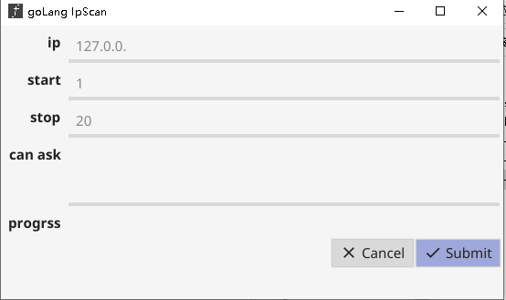
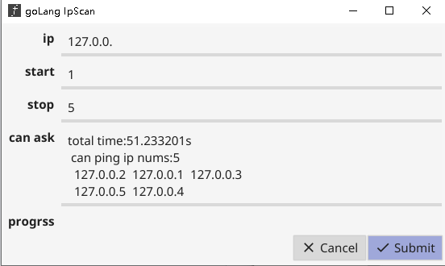

# ipScan
golagn版本极速扫描网段内可ping ip小工具，主要特征：轻量，简洁，极速。

## 相关框架
https://fyne.io/develop/cross-compiling.html
https://goframe.org

## 软件界面
   首页<br/>
   执行结果<br/>

## 常用命令
```golang
go mod download
go mod vendor
go get github.com/lucor/fyne-cross
fyne-cross --targets=linux/amd64,windows/amd64,darwin/amd64
```

### 更新日志
1. windows下会弹出cmd窗口
检测ip可ping:gproc.ShellExec()方法打包后，会弹出cmd窗口，换成go-ping库


### docker镜像
fyne-cross命令打包了对docker镜像的操作，下载，启动容器并打包等操作，了解以下命令，可以对docker镜像进行升级定制，
如升级golang版本，设置go get proxy等。

```shell script
#启动并进入一个镜像的容器
docker run -t -i lucor/fyne-cross:develop /bin/bash
docker run -t -i --net host lucor/fyne-cross:develop /bin/bash

#修改镜像，创建个目录 /go 是该镜像的 GOPATH
mkdir -p /go/pkg_local

#不要exit 另开一个窗口看下当前容器id  例如为 2550ea51c7e6  就会把对应版本的镜像替换
#commit完成前 主窗口中不能exit退出
docker commit 2550ea51c7e6  lucor/fyne-cross:develop

#重新进入新镜像容器 把本地gopath虚拟目录挂载
docker run -t -i  -v /home/gopath/:/go/pkg_local  lucor/fyne-cross:develop /bin/bash
#挂载目录的包复制到容器中
cp -r /go/pkg_local/pkg/* /go/pkg/

#不要exit 另开一个窗口看下当前容器id  例如为 123  就会把对应版本的镜像替换，此时镜像就有本地一样的包了
docker commit 123  lucor/fyne-cross:develop


#升级镜像自带go，升级到最新版本
#操作参考 https://www.cnblogs.com/nickchou/p/10934025.html

#切记执行这个，设置代理，否则有的包下载不下来
go env -w GOPROXY=https://goproxy.cn,direct

```
